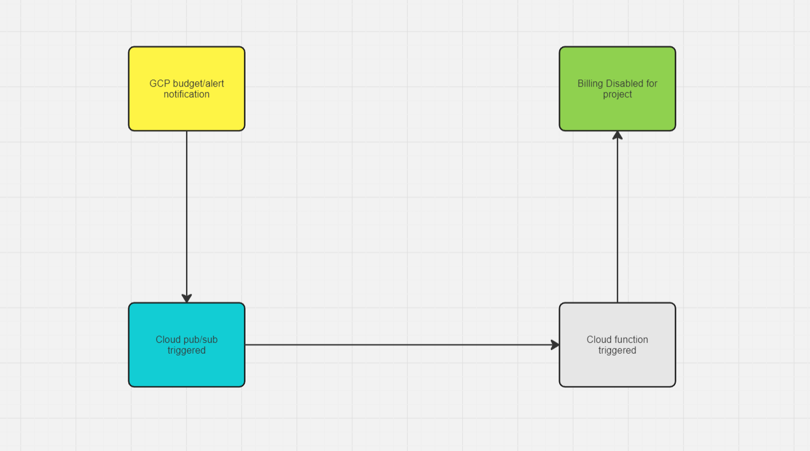

# Automated Billing Control for Google Cloud Projects

 This repository contains code to disable billing for your Google Cloud project when the billing amount exceeds specified threshold limit.

This is particularly useful for personal projects, proof of concepts (POCs), or testing environments. It offers a safeguard against overspending by providing an automated response to billing thresholds, making it an ideal solution for individual developers or small teams who need to manage their cloud expenses carefully.

However, it is important to note that this project is not intended for production use. It serves as a practical tool for non-production scenarios where cost control is crucial, but high availability and robustness are not as critical. By implementing this solution, you can experiment and test your cloud-based projects with peace of mind, knowing that your spending will be kept in check.

The core functionality is designed to trigger a Pub/Sub event when the billing amount crosses a specified threshold. Once this threshold is reached, a Cloud Function is executed, which automatically disables billing for the project. This mechanism ensures that you don't incur unexpected costs beyond your defined limit.

